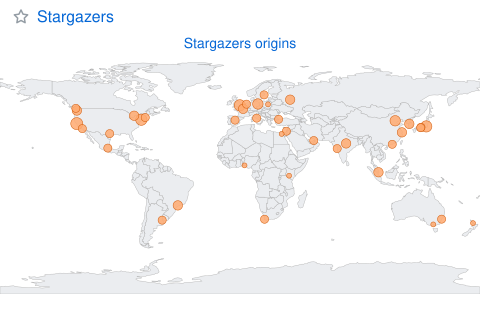

# github-metrics

[](https://github.com/mjun0812/github-metrics/actions/workflows/go-ci.yml)
[](https://github.com/mjun0812/github-metrics/releases)
[](https://github.com/mjun0812/github-metrics/blob/main/go.mod)
[](LICENSE)

This project is a Go reimplementation of [lowlighter/metrics](https://github.com/lowlighter/metrics).
It is a single Go binary that generates GitHub profile or repository metrics as SVG / PNG / JPEG / JSON,
without the Node runtime or headless Chrome that `lowlighter/metrics` requires.
It runs as a **GitHub Action**, a **standalone CLI**, or a **Docker** container.

Existing `lowlighter/metrics` workflows continue to work by swapping only the `uses:` line.
See [`docs/migration-to-go.md`](docs/migration-to-go.md) for the migration guide and the list of unported features.

## Plugins

<!-- AUTOGEN_START: plugins-gallery -->
| | | |
|:---:|:---:|:---:|
| [](docs/plugins/achievements.md) | [](docs/plugins/activity.md) | [](docs/plugins/calendar.md) |
| [`achievements`](docs/plugins/achievements.md) | [`activity`](docs/plugins/activity.md) | [`calendar`](docs/plugins/calendar.md) |
| [](docs/plugins/contributors.md) | [](docs/plugins/habits.md) | [](docs/plugins/header.md) |
| [`contributors`](docs/plugins/contributors.md) | [`habits`](docs/plugins/habits.md) | [`header`](docs/plugins/header.md) |
| [](docs/plugins/isocalendar.md) | [](docs/plugins/languages.md) | [](docs/plugins/notable.md) |
| [`isocalendar`](docs/plugins/isocalendar.md) | [`languages`](docs/plugins/languages.md) | [`notable`](docs/plugins/notable.md) |
| [](docs/plugins/people.md) | [](docs/plugins/reactions.md) | [](docs/plugins/repositories.md) |
| [`people`](docs/plugins/people.md) | [`reactions`](docs/plugins/reactions.md) | [`repositories`](docs/plugins/repositories.md) |
| [](docs/plugins/sponsors.md) | [](docs/plugins/sponsorships.md) | [](docs/plugins/stargazers.md) |
| [`sponsors`](docs/plugins/sponsors.md) | [`sponsorships`](docs/plugins/sponsorships.md) | [`stargazers`](docs/plugins/stargazers.md) |
| [](docs/plugins/starlists.md) | [](docs/plugins/stars.md) | [](docs/plugins/topics.md) |
| [`starlists`](docs/plugins/starlists.md) | [`stars`](docs/plugins/stars.md) | [`topics`](docs/plugins/topics.md) |
| [](docs/plugins/traffic.md) | [](docs/plugins/stargazers.md) | |
| [`traffic`](docs/plugins/traffic.md) | [`stargazers` — worldmap](docs/plugins/stargazers.md) | |
<!-- AUTOGEN_END: plugins-gallery -->

Refer to [`action.yml`](action.yml) for the full list of inputs. They are identical to the corresponding `lowlighter/metrics` inputs.
There are currently two templates, `classic` and `repository`: `classic` renders a user profile, and `repository` renders repository information.

## Usage

### Authentication

Every invocation requires a GitHub token.

- **GitHub Action**: pass it via `with.token`. Use `${{ secrets.METRICS_TOKEN }}` (a Personal Access Token) for full metrics, or `${{ github.token }}` when public data is enough. The runner exposes `with:` keys as `INPUT_<UPPER>` environment variables, which the unified pipeline reads automatically.
- **CLI / Docker**: export `GITHUB_TOKEN` in the environment (e.g. `GITHUB_TOKEN=$(gh auth token)`). The binary reads it automatically.

The token needs at minimum `public_repo` (classic PAT). For fine-grained tokens it needs the read scopes for the data each enabled plugin accesses (issues, pulls, projects, and so on).

### GitHub Action

```yaml
# .github/workflows/metrics.yml
name: Metrics
on:
  schedule: [{ cron: "0 0 * * *" }]
  workflow_dispatch:

jobs:
  github-metrics:
    runs-on: ubuntu-latest
    steps:
      - uses: mjun0812/github-metrics@latest
        with:
          user: octocat
          token: ${{ secrets.METRICS_TOKEN }}
          template: classic
          combined: "yes"
          plugin_languages: "yes"
          plugin_languages_limit: "5"
          committer_branch: main
          output_action: commit
          output_condition: data-changed

      # Repository
      - uses: mjun0812/github-metrics@latest
        with:
          user: ${{ github.repository_owner }}
          repo: ${{ github.event.repository.name }}
          template: repository
          token: ${{ secrets.METRICS_TOKEN }}
          combined: "yes" # the repository template renders a single combined SVG
```

Pass `combined: 'yes'` in the workflow to get a single combined SVG.
See [docs/examples/profile-readme.md](docs/examples/profile-readme.md) for a complete workflow example.

### CLI

```sh
# Install from a GitHub Release (linux/darwin × amd64/arm64).
# Fetch the latest version from the GitHub API and assign it to the VERSION environment variable.
VERSION=$(curl -s https://api.github.com/repos/mjun0812/github-metrics/releases/latest | grep -oE '"tag_name": "[^"]+"' | cut -d'"' -f4)

# Linux (amd64)
curl -L -o metrics-cli \
  "https://github.com/mjun0812/github-metrics/releases/download/${VERSION}/metrics-cli_${VERSION}_linux_amd64"
chmod +x metrics-cli

# macOS (Apple Silicon / arm64)
curl -L -o metrics-cli \
  "https://github.com/mjun0812/github-metrics/releases/download/${VERSION}/metrics-cli_${VERSION}_darwin_arm64"
chmod +x metrics-cli

# Or via go install (requires Go 1.26+):
go install github.com/mjun0812/github-metrics/cmd/metrics-cli@latest

# Render an SVG to stdout. Set GITHUB_TOKEN in your shell beforehand.
GITHUB_TOKEN=$(gh auth token) metrics-cli --user octocat \
  --output svg --dryrun --filename -
```

### Docker

```sh
docker run --rm \
  -v "$PWD/out:/renders" \
  -w /renders \
  -e GITHUB_TOKEN \
  ghcr.io/mjun0812/github-metrics:latest \
  --user octocat --template classic \
  --output svg --filename github-metrics.svg
```

### Output formats

| Format         | MIME               | Rendering pipeline                             |
| -------------- | ------------------ | ---------------------------------------------- |
| `svg`          | `image/svg+xml`    | Go templates (height computed in Go)           |
| `png` / `jpeg` | `image/png/jpeg`   | SVG → resvg rasterizer (jpeg re-encoded in Go) |
| `json`         | `application/json` | Byte-compatible with `lowlighter/metrics`      |

The JSON output is **byte-compatible** with `lowlighter/metrics` for the adopted plugins.
The SVG output is **DOM-structurally equivalent**: element / attribute / class structure matches `lowlighter/metrics`,
though dynamic strings (version footer, generated timestamp) differ.

### Profile README

The default output mode writes one SVG per enabled plugin into `output_dir` (default `./metrics-renders/`).
Compose your profile README by embedding the per-plugin SVGs.

```markdown


<br clear="both">


```

## Migrating from `lowlighter/metrics`

1. Swap the `uses:` line.

   ```diff
   - uses: lowlighter/metrics@v3.34
   + uses: mjun0812/github-metrics@v5
   ```

2. Re-run the workflow. Unported plugin gates can remain in the `with:` block; remove them whenever convenient.

3. Compare the output. JSON should diff cleanly. SVG should match structurally (run `xmllint --format` before diffing).

[`docs/migration-to-go.md`](docs/migration-to-go.md) contains the full matrix: adopted vs. unported plugins, templates, output formats, and the one-line rollback procedure.

## Release verification

Every release is signed with cosign keyless OIDC against the GitHub Actions issuer. To verify an image manifest, run:

```sh
cosign verify ghcr.io/mjun0812/github-metrics:v5.0.0 \
  --certificate-identity-regexp \
    'https://github.com/mjun0812/github-metrics/.github/workflows/release.yml@refs/tags/v.*' \
  --certificate-oidc-issuer https://token.actions.githubusercontent.com
```

Binaries attached to each GitHub Release ship with a `SHA256SUMS` file plus per-artifact `.sig`, `.cert`, and `.cosign.bundle` files.
Use `cosign verify-blob` to verify a binary.

```sh
cosign verify-blob metrics-cli_v5.0.0_linux_amd64 \
  --bundle metrics-cli_v5.0.0_linux_amd64.cosign.bundle \
  --certificate-identity-regexp \
    'https://github.com/mjun0812/github-metrics/.github/workflows/release.yml@refs/tags/v.*' \
  --certificate-oidc-issuer https://token.actions.githubusercontent.com
```

## Contribute

Bug reports and pull requests are welcome. Before opening a PR, please read [`CONTRIBUTING.md`](CONTRIBUTING.md) for the development workflow (toolchain, hooks, test categories) and the project's scope discipline. The list of unported features lives in [`docs/migration-to-go.md`](docs/migration-to-go.md).

## License

[MIT](LICENSE). This project is a Go reimplementation derived from [lowlighter/metrics](https://github.com/lowlighter/metrics) (MIT-licensed). The `lowlighter/metrics` attribution is preserved per the MIT license terms.

The GitHub Octicons assets (under `assets/octicons/`) are MIT-licensed by GitHub, Inc. and embedded via `//go:embed`.
