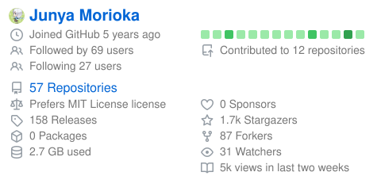
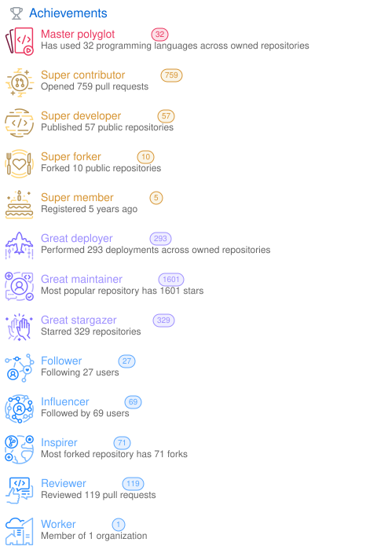

# upstream ↔ Go実装 出力比較 (plugin parity)

各 plugin について、**左 = upstream `lowlighter/metrics` の公式出力**、**右 = 本リポジトリ Go 実装の出力** を並べて、レイアウト・DOM 構造のパリティを目視確認するためのページです。

- 左 (upstream): [`docs/original_examples/`](original_examples/) — `lowlighter/metrics` の `examples` ブランチ (commit `1dac69e`)。lowlighter 本人のプロフィールデータをレンダリングした正規サンプル。出所詳細は [original_examples/README.md](original_examples/README.md)。
- 右 (Go 実装): [`docs/examples/`](examples/) — 本リポジトリのサンプル出力。`make docs-samples` (= `scripts/gen-doc-samples.sh`) で `mjun0812` のデータからレンダリング。

## 凡例 / 注意

- ⚠ **データソースが異なるため数値・項目は一致しません**。確認対象は「枠・配色・要素の配置・DOM 構造」が upstream と同等か（= parity）です。
- 📁 **= ファイルサイズが大きく (>500KB) 埋め込むと GitHub 表示が重いためリンク**にしています。クリックで表示してください。
- 一部の SVG は `<foreignObject>` (HTML 埋め込み) を含み、`` 経由だとブラウザ / GitHub 上で HTML 部分が描画されないことがあります。崩れて見える場合はファイルを直接開いて確認してください。
- 表示幅は `width="420"` で統一しています（原寸は各ファイル参照）。
- **空カードについて**: 右の Go 実装サンプルは `mjun0812` のデータを使うため、本人に該当データが無い plugin（topics / starlists / sponsors / projects 等）は枠だけの空表示になります。これは未実装ではなく「サンプルユーザーにデータが無い」ためです。
- **repository mode**: M7 で実装した `--template repository` のサンプルは「base chrome 単体」と「単体 toggle で base chrome と byte 差を生む plugin」のみを `plugin-<slug>-repo.svg` / `.png` として生成しています。対象リポジトリは `mjun0812/flash-attention-prebuild-wheels`（owner 本人なので traffic plugin も実データを取得）。詳細・除外理由 (byte-identical / user-mode-only / partial 未登録) は本ページ末尾の [「repository mode サンプル一覧」](#repository-mode-サンプル一覧) を参照。

## variant（サブモード）の Go 実装対応状況

upstream に存在する各 plugin のサブモードについて、Go 実装の対応状況です。

| upstream variant                 | Go 側                   | 備考                                                                                                                |
| -------------------------------- | ----------------------- | ------------------------------------------------------------------------------------------------------------------- |
| `languages.recent`               | ✅ 比較可               | `plugin-languages-recent.svg`                                                                                       |
| `languages.indepth`              | ✅ 比較可               | `plugin-languages-indepth.svg`                                                                                      |
| `languages.details`              | ✅ 比較可               | `plugin-languages-details.svg`（本対応で追加）                                                                      |
| `achievements.compact`           | ✅ 比較可               | `plugin-achievements-compact.svg`（本対応で追加）                                                                   |
| `isocalendar.fullyear`           | ✅ 比較可               | `plugin-isocalendar-fullyear.svg`（本対応で追加）                                                                   |
| `calendar.full`                  | ◐ 対応・差分なし        | `plugin_calendar_limit=0` を受け付けるが、このサンプルデータでは無印とバイト同一                                    |
| `repositories.pinned`            | ◐ 対応・差分なし        | `plugin_repositories_pinned` を受け付けるが、このサンプルデータでは無印とバイト同一                                 |
| `topics.icons`                   | ○ データ無し            | `plugin_topics_mode=icons` 対応。サンプルユーザーに topics 無しで空                                                 |
| `starlists.languages`            | ○ データ無し            | `plugin_starlists_languages` 対応。サンプルユーザーにデータ無しで空                                                 |
| `sponsors.full`                  | ○ データ無し            | `plugin_sponsors_sections` 対応。サンプルユーザーにデータ無しで空                                                   |
| `habits.facts` / `habits.charts` | ✅ 比較可               | `plugin_habits_facts` / `plugin_habits_charts` で個別トグル。`plugin-habits-facts.svg` / `plugin-habits-charts.svg` |
| `notable.indepth`                | ✅ 比較可               | `plugin_notable_indepth` 対応。`@owner/repo` 粒度チップ + 統計ゲージ。`plugin-notable-indepth.svg`                  |
| `contributors.contributions`     | ✅ 比較可（repo mode）  | `plugin_contributors_contributions` 対応。`plugin-contributors-repo-contributions.svg` で adds/dels 列を表示         |
| `stargazers.graph`               | ✅ 比較可               | `plugin_stargazers_charts_type=graph` 対応。`plugin-stargazers-graph.svg`                                           |
| `stargazers.worldmap`            | ✗ 未対応                | backlog（Google Maps API、R-012 Skipped path）                                                                      |
| `stargazers.chartist`            | ◐ graph と同一          | `charts_type=chartist` は deprecated alias。`graph` とバイト同一出力                                                |
| `people.repository`              | ✅ 比較可（repo mode）  | contributors/stargazers/watchers 対応。`plugin-people-repo-types.svg` で 3 種同時表示                                |

✅ = 左右比較可 / ◐ = Go は対応するがサンプル差分なし・または repository 専用 / deprecated alias でサンプル省略 / ○ = Go は対応するがサンプルユーザーにデータ無し（空） / ✗ = Go 実装が未対応（要実装・backlog）

---

## テンプレート / base

upstream の参考表示と Go 実装側の対応サンプルを並べています。`classic 総合` は upstream の `metrics.classic.svg` (= 実質 base ヘッダのみ) に対し、Go 側は採用 19 plugin のうち `mjun0812` で非空となる主要 12 plugin (`isocalendar` / `calendar` / `languages` / `activity` / `achievements` / `notable` / `repositories` / `habits` / `stars` / `reactions` / `stargazers` / `traffic`) を合成した overview を表示します。`repository 総合` は `--template repository --repo mjun0812/flash-attention-prebuild-wheels` で、repository template の `_.json` に partial を持つ 5 plugin (`languages` / `contributors` / `people` / `stargazers` / `activity`) を合成した overview です。

| 種別               | upstream                                                         | Go 実装                                                       |
| ------------------ | ---------------------------------------------------------------- | ------------------------------------------------------------- |
| base (plugin なし) |        |               |
| classic 総合       |     |           |
| repository 総合    |  |        |

> ✅ Go サンプル `metrics-classic.svg` / `.png` は `scripts/gen-doc-samples.sh` の独立セクションで生成。複数 plugin を 1 回の `render_one` で合成。データ無しで空表示になる plugin (`contributors` / `projects` / `sponsors` / `sponsorships` / `starlists` / `topics`) と巨大化する `people` は除外し、合成 SVG は ~370KB / 高さ ~3976px。
> ✅ Go サンプル `metrics-repository.svg` / `.png` は同スクリプトの repository mode セクションで生成。`mjun0812/flash-attention-prebuild-wheels` を対象に、repository template の `_.json` に partial を持つ plugin だけを合成しています: languages / contributors (+ contributions) / people (stargazers + watchers + contributors) / stargazers (graph) / activity。`traffic` 等 partial を持たない plugin はトグルしても出力に反映されないため合成対象外（repository chrome のみ）。

### base partial parity (`base.header` / `base.repositories`)

`base.header.ejs` / `base.repositories.ejs` で upstream が描画する 14 フィールドのうち、本リポジトリの実装状況です。両 partial は全 60 サンプル SVG が embed する基盤のため、ここのカバレッジが上がると全サンプルの見た目が一斉に改善します。詳細は [#429](https://github.com/mjun0812/github-metrics/issues/429) (Phase 1〜3 で段階リリース)。

| partial             | フィールド                          | 状態          | データソース                                  |
| ------------------- | ----------------------------------- | ------------- | --------------------------------------------- |
| `base.header`       | Avatar + display name               | ✅ 実装済み   | `user.{avatarUrl,name,login}`                 |
| `base.header`       | Joined GitHub `<age>`               | ✅ Phase 1    | `user.createdAt`                              |
| `base.header`       | Followed by N users                 | ✅ Phase 1    | `user.followers.totalCount`                   |
| `base.header`       | Following N users                   | ✅ Phase 1    | `user.following.totalCount`                   |
| `base.header`       | Contributed to N repositories       | ⏳ Phase 2    | `user.repositoriesContributedTo`（indepth）   |
| `base.header`       | Contribution calendar 11×1 grid     | ⏳ Phase 3    | `user.contributionsCollection.contributionCalendar` |
| `base.repositories` | N repositories                      | ✅ 実装済み   | `Computed.Repositories.Count`                 |
| `base.repositories` | N stargazers                        | ✅ 実装済み   | `Computed.Repositories.Stargazers`            |
| `base.repositories` | N forks                             | ✅ 実装済み   | `Computed.Repositories.Forks`                 |
| `base.repositories` | Watching N repositories             | ✅ Phase 1    | `user.watching.totalCount`                    |
| `base.repositories` | N sponsors                          | ✅ Phase 1    | `user.sponsorshipsAsMaintainer.totalCount`    |
| `base.repositories` | License preference                  | ⏳ Phase 2    | `repository.licenseInfo` の集計               |
| `base.repositories` | Releases / Packages / Disk used     | ⏳ Phase 2    | `repository.{releases,packages,diskUsage}`    |
| n/a (out of scope)  | `+N added` / `-N removed`           | ✗ 永久対象外  | M8 不採用の `lines` plugin (`docs/design/15-selection-answer.md` §1) |

> Phase 1 の octicon は中立な `<svg class="octicon"></svg>` placeholder です。upstream と同等のアイコン path 形状は Phase 2 / Phase 3 で揃えます。

---

## plugin 比較

### languages

| upstream                                                               | Go 実装 (`plugin-languages.svg`)                      |
| ---------------------------------------------------------------------- | ----------------------------------------------------- |
|  |  |

**variant: details** — upstream `languages.details` ↔ Go `plugin-languages-details.svg`

| upstream                                                                       | Go 実装                                                       |
| ------------------------------------------------------------------------------ | ------------------------------------------------------------- |
|  |  |

### languages.recent

| upstream                                                                      | Go 実装 (`plugin-languages-recent.svg`)                      |
| ----------------------------------------------------------------------------- | ------------------------------------------------------------ |
|  |  |

### languages.indepth

| upstream                                                                       | Go 実装 (`plugin-languages-indepth.svg`)                      |
| ------------------------------------------------------------------------------ | ------------------------------------------------------------- |
|  |  |

### activity

| upstream                                                              | Go 実装 (`plugin-activity.svg`)                      |
| --------------------------------------------------------------------- | ---------------------------------------------------- |
|  |  |

### achievements

| upstream                                                                  | Go 実装                                                  |
| ------------------------------------------------------------------------- | -------------------------------------------------------- |
|  |  |

他バリアント (upstream):  (compact)

> ✅ Go 側は `plugin_achievements_display=compact` に対応。Go サンプルは `scripts/gen-doc-samples.sh` で `plugin-achievements-compact.svg` / `.png` として生成。

### repositories

| upstream                                                                  | Go 実装 (`plugin-repositories.svg`)                      |
| ------------------------------------------------------------------------- | -------------------------------------------------------- |
|  |  |

他バリアント (upstream):  (pinned)

> ◐ Go 側は `plugin_repositories_pinned` を受け付けるが、サンプルデータでは無印と同一出力のため別サンプルなし。

### isocalendar

| upstream                                                                 | Go 実装 (`plugin-isocalendar.svg`)                      |
| ------------------------------------------------------------------------ | ------------------------------------------------------- |
|  |  |

**variant: fullyear** — upstream `isocalendar.fullyear` ↔ Go `plugin-isocalendar-fullyear.svg`

| upstream                                                                          | Go 実装                                                          |
| --------------------------------------------------------------------------------- | ---------------------------------------------------------------- |
|  |  |

### calendar

| upstream                                                              | Go 実装 (`plugin-calendar.svg`)                      |
| --------------------------------------------------------------------- | ---------------------------------------------------- |
|  |  |

他バリアント (upstream):  (full)

> ◐ Go 側は `plugin_calendar_limit=0` を受け付けるが、サンプルデータでは無印と同一出力のため別サンプルなし。

### habits

| upstream (charts)                                                          | Go 実装 (`plugin-habits.svg`)                      |
| -------------------------------------------------------------------------- | -------------------------------------------------- |
|  |  |

他バリアント (upstream):  (facts)

> ✅ Go 側は `plugin_habits_facts` / `plugin_habits_charts` で facts / charts を個別トグル。Go サンプル: `plugin-habits-facts.svg`（facts のみ）/ `plugin-habits-charts.svg`（charts のみ）。

### stars

| upstream                                                           | Go 実装 (`plugin-stars.svg`)                      |
| ------------------------------------------------------------------ | ------------------------------------------------- |
|  |  |

### topics

| upstream                                                            | Go 実装 (`plugin-topics.svg`)                      |
| ------------------------------------------------------------------- | -------------------------------------------------- |
|  |  |

他バリアント (upstream): 📁 [topics.icons (1.1 MB)](original_examples/metrics.plugin.topics.icons.svg)

> ○ Go 側は `plugin_topics_mode=icons` 対応だが、サンプルユーザーに topics 無しで空表示。
> 実装メモ: upstream は puppeteer で `/stars/<user>/topics` をスクレイピングするが、Go 実装は公開 SSR ページを HTTP + goquery で取得する (chromium 不要)。

### starlists

| upstream                                                               | Go 実装 (`plugin-starlists.svg`)                      |
| ---------------------------------------------------------------------- | ----------------------------------------------------- |
|  |  |

他バリアント (upstream):  (languages)

> ○ Go 側は `plugin_starlists_languages` 対応だが、サンプルユーザーにデータ無しで空表示。
> 実装メモ: upstream は puppeteer で `/stars/<user>/lists` をスクレイピングするが、Go 実装は GitHub GraphQL の `user.lists` を 1 クエリで取得する (chromium 不要)。

### people

Go 実装の `plugin-people.svg` は 5.8MB のため埋め込まずリンクにしています。

| upstream (followers)                                                          | Go 実装                                                     |
| ----------------------------------------------------------------------------- | ----------------------------------------------------------- |
|  | 📁 [plugin-people.svg (5.8 MB)](examples/plugin-people.svg) |

他バリアント (upstream): 📁 [people.repository (4.0 MB)](original_examples/metrics.plugin.people.repository.svg)

> ✅ Go 側は user mode (followers/following) に加え repository context types (contributors/stargazers/watchers) を実装済み。repository mode のサンプルは `plugin-people-repo.svg`（既定の stargazers + watchers）と `plugin-people-repo-types.svg`（3 種同時 = stargazers + watchers + contributors）。詳細は本ページ末尾の [repository mode サンプル一覧](#repository-mode-サンプル一覧) を参照。

### notable

| upstream                                                             | Go 実装 (`plugin-notable.svg`)                      |
| -------------------------------------------------------------------- | --------------------------------------------------- |
|  |  |

他バリアント (upstream):  (indepth)

> ✅ Go 側は `plugin_notable_indepth` 対応済み。indepth は基本モードの組織単位 (`@org`) ではなくリポジトリ単位 (`@org/repo`) のチップを描画し、commits / stars / issues / pulls の統計ゲージを付与する（upstream `notable.ejs` と同一 DOM）。Go サンプル: `plugin-notable-indepth.svg`。

### contributors

upstream の出力は両バリアントとも巨大 (9.9 / 8.7 MB) のためリンクにしています。

| upstream                                                                                            | Go 実装 (`plugin-contributors.svg`)                      |
| --------------------------------------------------------------------------------------------------- | -------------------------------------------------------- |
| 📁 [contributors.categories (9.9 MB)](original_examples/metrics.plugin.contributors.categories.svg) |  |

他バリアント (upstream): 📁 [contributors.contributions (8.7 MB)](original_examples/metrics.plugin.contributors.contributions.svg)

> ✅ Go 側は `plugin_contributors_contributions` 対応済み（per-contributor commits / additions / deletions）。default mode の repository サンプルは base chrome の contributors セクションが担当し、adds/dels 列付きの変種は `plugin-contributors-repo-contributions.svg` を参照（既定 commits のみのサンプルは `plugin-base-repo.svg` と byte 同一になるため削除済み）。`stats pending` 警告は `/stats/contributors` の cache が暖まる前に 202 が返った場合に表示される（#424）。詳細は末尾の [repository mode サンプル一覧](#repository-mode-サンプル一覧) を参照。

### reactions

| upstream                                                               | Go 実装 (`plugin-reactions.svg`)                      |
| ---------------------------------------------------------------------- | ----------------------------------------------------- |
|  |  |

### projects

| upstream                                                              | Go 実装 (`plugin-projects.svg`)                      |
| --------------------------------------------------------------------- | ---------------------------------------------------- |
|  |  |

### sponsors

| upstream                                                              | Go 実装 (`plugin-sponsors.svg`)                      |
| --------------------------------------------------------------------- | ---------------------------------------------------- |
|  |  |

他バリアント (upstream):  (full)

> ○ Go 側は `plugin_sponsors_sections=goal,about,list` で full 相当を表現可能だが、サンプルユーザーにデータ無しで空表示。

### sponsorships

| upstream                                                                  | Go 実装 (`plugin-sponsorships.svg`)                      |
| ------------------------------------------------------------------------- | -------------------------------------------------------- |
|  |  |

### stargazers

| upstream                                                                | Go 実装 (`plugin-stargazers.svg`)                      |
| ----------------------------------------------------------------------- | ------------------------------------------------------ |
|  |  |

他バリアント (upstream):  (graph) /  (chartist) / 📁 [stargazers.worldmap (1.5 MB)](original_examples/metrics.plugin.stargazers.worldmap.svg)

> ✅ Go 側は `plugin_stargazers_charts_type=graph` 対応（`chartist` は graph の deprecated alias でバイト同一）。Go サンプル: `plugin-stargazers-graph.svg`。worldmap は Google Maps API 必須の backlog（Skipped path、未対応）。

### traffic

| upstream                                                             | Go 実装 (`plugin-traffic.svg`)                      |
| -------------------------------------------------------------------- | --------------------------------------------------- |
|  |  |

> ✅ Go 側: user mode は token owner が admin の全 repo に対して `/traffic/views` を並列取得して合計表示。`--template repository` 単体では traffic partial が `_.json` に登録されていないため出力が `plugin-base-repo.svg` と byte 同一になり、専用サンプルは生成していない（plugin の Run() 自体は単一 repo の views を計算するが描画される partial がない）。upstream の `metrics.repository.svg` も同様に traffic を含まないため parity 維持。admin 権限の有無で Run() が "missing repo scope" で Skipped になる挙動は user-mode サンプルでカバー済み。

---

## repository mode サンプル一覧

`--template repository --user mjun0812 --repo flash-attention-prebuild-wheels` で生成した repository-mode サンプル一覧です。`scripts/gen-doc-samples.sh` の repository mode セクションで `make docs-samples` 実行時に自動再生成されます。

`--template repository` は `assets/templates/repository/partials/_.json` の固定 partial 順 (`base.header` → `introduction` → `followup` → `languages` → `projects` → `pagespeed` → `stargazers` → `people` → `activity` → `posts` → `rss` → `screenshot` → `stock` → `crypto` → `contributors` → `sponsors` → `licenses`) でレンダリングします。base 系セクション (`base.header` / `introduction` / `activity` / `contributors` / `languages`) は `base.runRepository` が常に値を populate するため、ユーザーが `--plugin <slug>=yes` を渡さなくても chrome として表示されます。

そのうえで、`--plugin <slug>=yes` トグルが追加の効果を持つ plugin は **`mjun0812/flash-attention-prebuild-wheels` で実測した限り** 以下に限定されます:

| 効果あり (repo mode で出力が変わる)   | 効果なし (chrome と byte 同一になる)                                                                                                                                                                                                                                                                |
| ------------------------------------- | --------------------------------------------------------------------------------------------------------------------------------------------------------------------------------------------------------------------------------------------------------------------------------------------------- |
| `people` (新規 `<section data-section="people">` を追加)<br>`contributors_contributions` (chrome の contributors セクションに adds/dels 列を追加) | `achievements` / `activity` / `calendar` / `contributors` (chrome 側ですでに描画) / `habits` / `isocalendar` / `languages` (chrome 側ですでに描画) / `notable` / `projects` (データ無し) / `reactions` / `repositories` / `sponsors` (データ無し) / `sponsorships` / `stargazers` (M7 MVP は totals のみで partial は空文字列) / `starlists` / `stars` / `topics` / `traffic` (partial 未登録) |

「効果なし」側の plugin (18 個) は `plugin-<slug>-repo.svg` を生成しても `plugin-base-repo.svg` と byte 同一になります（md5 一致を実測で確認済）。これは未実装ではなく:

1. base 系セクションは plugin toggle 不要で常に描画される
2. partial が template の `_.json` にない / partial が空文字列 / 対象データが無い
3. plugin 自体が user mode 専用（mode gate により Skipped を返す）

のいずれかの理由による意図的な挙動で、upstream `metrics.repository.svg` でも同じ partial 集合のみが描画されます。

これらの byte 同一サンプル (`plugin-<slug>-repo.{svg,png}` × 18) は `docs/examples/` から削除しました。「網羅性のために並べる」よりも「意味のあるサンプルだけを残す」方が docs の信号雑音比が高いと判断しています。残った repository-mode サンプルは下の追加バリアント / 総合サンプル表のみで、ユーザーは「base chrome のみ」「people セクションを足すと何が増えるか」「contributors の per-row 列を足すと何が増えるか」を 1 ファイルずつ比較できます。

#### mode-not-supported warning

user mode 専用 plugin (14 個 = achievements / activity / calendar / habits / isocalendar / notable / projects / reactions / repositories / sponsors / sponsorships / starlists / stars / topics) を `--template repository` で起動すると、各 plugin の `Run()` は冒頭で `plugins.RequireUserMode()` を呼び、descriptive な reason をログに出して即 Skipped を返します。逆向きの contributors plugin（repository mode 専用）は `RequireRepoMode()` でユーザーモード時に同様の WARN を出します。

実行例:

```text
level=WARN msg="plugin achievements is only supported in user mode (current mode: repository)" plugin=achievements mode=repository supported=user
level=WARN msg="plugin contributors is only supported in repository mode (current mode: user)" plugin=contributors mode=user supported=repository
```

これにより operator は CI ログから「なぜこの plugin が空 SVG を返したか」を即特定できます。実装は `internal/plugins/modegate.go` 参照。

### 単体サンプル

| plugin         | sample                                       | 備考                                                  |
| -------------- | -------------------------------------------- | ----------------------------------------------------- |
| base           | `examples/plugin-base-repo.svg`              | repository template chrome のみ（plugin toggle なし） |
| people         | `examples/plugin-people-repo.svg`            | `<section data-section="people">` 追加（既定 = stargazers + watchers） |

### 追加バリアント

| variant                              | sample                                              | 内容                                                 |
| ------------------------------------ | --------------------------------------------------- | ---------------------------------------------------- |
| `contributors.contributions` (repo)  | `examples/plugin-contributors-repo-contributions.svg` | `/stats/contributors` 経由で adds/dels 列を表示       |
| `people.types` (repo)                | `examples/plugin-people-repo-types.svg`               | stargazers + watchers + contributors を 1 カードで併記 |

### 総合サンプル

| sample                            | 内容                                                                                             |
| --------------------------------- | ------------------------------------------------------------------------------------------------ |
| `examples/metrics-repository.svg` | repository template overview。`_.json` に partial を持つ 5 plugin (`languages` / `stargazers` (graph) / `people` (stargazers + watchers + contributors) / `activity` / `contributors` (with contributions)) を合成 |
