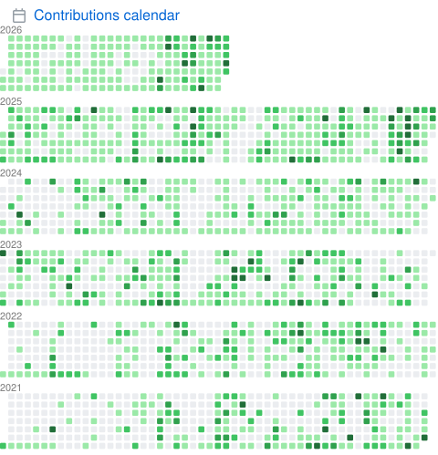
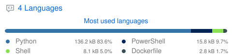

# Output comparison

Side-by-side comparison of each plugin's output:

- **Left** — upstream [`lowlighter/metrics`](https://github.com/lowlighter/metrics) rendered with lowlighter's profile data. Source: [`docs/original_examples/`](original_examples/).
- **Middle** — upstream `lowlighter/metrics@v3.34` rendered with `mjun0812`'s data, as an apples-to-apples reference. Source: [`docs/reference_examples/`](reference_examples/).
- **Right** — this project's Go implementation rendered with `mjun0812`'s data. Source: [`docs/examples/`](examples/).

The left column uses a different data source, so the numbers will not match. The middle and right columns use the same data and should match at the DOM / layout level.

## Templates

| Type       | upstream (lowlighter)                                            | upstream (mjun0812)                                               | Go (mjun0812)                                           |
| ---------- | ---------------------------------------------------------------- | ----------------------------------------------------------------- | ------------------------------------------------------- |
| header     |        |        |       |
| classic    |     |     |     |
| repository |  |  |  |

## Plugins

### languages

| upstream (lowlighter)                                                  | upstream (mjun0812)                                                     | Go (`plugin-languages.svg`)                           |
| ---------------------------------------------------------------------- | ----------------------------------------------------------------------- | ----------------------------------------------------- |
|  |  |  |

**variant: details**

| upstream (lowlighter)                                                          | upstream (mjun0812)                                                             | Go                                                            |
| ------------------------------------------------------------------------------ | ------------------------------------------------------------------------------- | ------------------------------------------------------------- |
|  |  |  |

**variant: recent**

| upstream (lowlighter)                                                         | upstream (mjun0812)                                | Go                                                           |
| ----------------------------------------------------------------------------- | -------------------------------------------------- | ------------------------------------------------------------ |
|  | — _upstream v3.34 bug (TypeError in `recent.mjs`)_ |  |

**variant: indepth**

| upstream (lowlighter)                                                          | upstream (mjun0812)                                                             | Go                                                            |
| ------------------------------------------------------------------------------ | ------------------------------------------------------------------------------- | ------------------------------------------------------------- |
|  |  |  |

### activity

| upstream (lowlighter)                                                 | upstream (mjun0812)                                                       | Go (`plugin-activity.svg`)                           |
| --------------------------------------------------------------------- | ------------------------------------------------------------------------- | ---------------------------------------------------- |
|  | — _upstream v3.34 bug (`TypeError: Cannot read properties of undefined`)_ |  |

### achievements

| upstream (lowlighter)                                                     | upstream (mjun0812)                                                            | Go (`plugin-achievements.svg`)                           |
| ------------------------------------------------------------------------- | ------------------------------------------------------------------------------ | -------------------------------------------------------- |
|  | — _GitHub deprecated the Projects (classic) API; upstream returns `NOT_FOUND`_ |  |

**variant: compact**

| upstream (lowlighter)                                                             | upstream (mjun0812)                                                            | Go                                                               |
| --------------------------------------------------------------------------------- | ------------------------------------------------------------------------------ | ---------------------------------------------------------------- |
|  | — _GitHub deprecated the Projects (classic) API; upstream returns `NOT_FOUND`_ |  |

### repositories

| upstream (lowlighter)                                                     | upstream (mjun0812)                                                        | Go (`plugin-repositories.svg`)                           |
| ------------------------------------------------------------------------- | -------------------------------------------------------------------------- | -------------------------------------------------------- |
|  |  |  |

**variant: pinned**

| upstream (lowlighter)                                                            | upstream (mjun0812)                                                               | Go                                                              |
| -------------------------------------------------------------------------------- | --------------------------------------------------------------------------------- | --------------------------------------------------------------- |
|  |  |  |

### isocalendar

| upstream (lowlighter)                                                    | upstream (mjun0812)                                                       | Go (`plugin-isocalendar.svg`)                           |
| ------------------------------------------------------------------------ | ------------------------------------------------------------------------- | ------------------------------------------------------- |
|  |  |  |

**variant: fullyear**

| upstream (lowlighter)                                                             | upstream (mjun0812)                                                                | Go                                                               |
| --------------------------------------------------------------------------------- | ---------------------------------------------------------------------------------- | ---------------------------------------------------------------- |
|  |  |  |

### calendar

| upstream (lowlighter)                                                 | upstream (mjun0812)                                                    | Go (`plugin-calendar.svg`)                           |
| --------------------------------------------------------------------- | ---------------------------------------------------------------------- | ---------------------------------------------------- |
|  |  |  |

**variant: full**

| upstream (lowlighter)                                                      | upstream (mjun0812)                                                         | Go                                                        |
| -------------------------------------------------------------------------- | --------------------------------------------------------------------------- | --------------------------------------------------------- |
|  |  |  |

### habits

| upstream (lowlighter)                                                      | upstream (mjun0812)                                                            | Go (`plugin-habits.svg`)                           |
| -------------------------------------------------------------------------- | ------------------------------------------------------------------------------ | -------------------------------------------------- |
|  | — _upstream v3.34 bug (`TypeError: Cannot destructure 'author' of undefined`)_ |  |

**variant: facts**

| upstream (lowlighter)                                                     | upstream (mjun0812)                                                            | Go                                                       |
| ------------------------------------------------------------------------- | ------------------------------------------------------------------------------ | -------------------------------------------------------- |
|  | — _upstream v3.34 bug (`TypeError: Cannot destructure 'author' of undefined`)_ |  |

**variant: charts**

| upstream (lowlighter)                                                      | upstream (mjun0812)                                                            | Go                                                        |
| -------------------------------------------------------------------------- | ------------------------------------------------------------------------------ | --------------------------------------------------------- |
|  | — _upstream v3.34 bug (`TypeError: Cannot destructure 'author' of undefined`)_ |  |

### stars

| upstream (lowlighter)                                              | upstream (mjun0812)                                                 | Go (`plugin-stars.svg`)                           |
| ------------------------------------------------------------------ | ------------------------------------------------------------------- | ------------------------------------------------- |
|  |  |  |

### topics

| upstream (lowlighter)                                               | upstream (mjun0812)                                                  | Go (`plugin-topics.svg`)                           |
| ------------------------------------------------------------------- | -------------------------------------------------------------------- | -------------------------------------------------- |
|  |  |  |

**variant: icons**

| upstream (lowlighter)                                                     | upstream (mjun0812)                                                        | Go                                                 |
| ------------------------------------------------------------------------- | -------------------------------------------------------------------------- | -------------------------------------------------- |
|  |  | — _the sample user has no topics on starred repos_ |

### starlists

| upstream (lowlighter)                                                  | upstream (mjun0812)                                                     | Go (`plugin-starlists.svg`)                           |
| ---------------------------------------------------------------------- | ----------------------------------------------------------------------- | ----------------------------------------------------- |
|  |  |  |

**variant: languages**

| upstream (lowlighter)                                                            | upstream (mjun0812)                  | Go                                   |
| -------------------------------------------------------------------------------- | ------------------------------------ | ------------------------------------ |
|  | — _the sample user has no starlists_ | — _the sample user has no starlists_ |

### people

| upstream (lowlighter)                                                         | upstream (mjun0812)                                                  | Go (`plugin-people.svg`)                           |
| ----------------------------------------------------------------------------- | -------------------------------------------------------------------- | -------------------------------------------------- |
|  |  |  |

**variant: repository**

| upstream (lowlighter)                                                          | upstream (mjun0812)                                                             | Go                                                            |
| ------------------------------------------------------------------------------ | ------------------------------------------------------------------------------- | ------------------------------------------------------------- |
|  |  |  |

### notable

| upstream (lowlighter)                                                | upstream (mjun0812)                                                   | Go (`plugin-notable.svg`)                           |
| -------------------------------------------------------------------- | --------------------------------------------------------------------- | --------------------------------------------------- |
|  |  |  |

**variant: indepth**

| upstream (lowlighter)                                                        | upstream (mjun0812)                                                           | Go                                                          |
| ---------------------------------------------------------------------------- | ----------------------------------------------------------------------------- | ----------------------------------------------------------- |
|  |  |  |

### contributors

| upstream (lowlighter)                                                                | upstream (mjun0812)                                                                   | Go                                                                          |
| ------------------------------------------------------------------------------------ | ------------------------------------------------------------------------------------- | --------------------------------------------------------------------------- |
|  |  |  |

**variant: contributions**

| upstream (lowlighter)                                                                   | upstream (mjun0812)                                                                   | Go                                                                          |
| --------------------------------------------------------------------------------------- | ------------------------------------------------------------------------------------- | --------------------------------------------------------------------------- |
|  |  |  |

### reactions

| upstream (lowlighter)                                                  | upstream (mjun0812)                                                     | Go (`plugin-reactions.svg`)                           |
| ---------------------------------------------------------------------- | ----------------------------------------------------------------------- | ----------------------------------------------------- |
|  |  |  |

### projects

| upstream (lowlighter)                                                 | upstream (mjun0812)                                                            | Go (`plugin-projects.svg`)                           |
| --------------------------------------------------------------------- | ------------------------------------------------------------------------------ | ---------------------------------------------------- |
|  | — _GitHub deprecated the Projects (classic) API; upstream returns `NOT_FOUND`_ |  |

### sponsors

| upstream (lowlighter)                                                 | upstream (mjun0812)                                                    | Go (`plugin-sponsors.svg`)                           |
| --------------------------------------------------------------------- | ---------------------------------------------------------------------- | ---------------------------------------------------- |
|  |  |  |

**variant: full**

| upstream (lowlighter)                                                      | upstream (mjun0812)                 | Go                                  |
| -------------------------------------------------------------------------- | ----------------------------------- | ----------------------------------- |
|  | — _the sample user has no sponsors_ | — _the sample user has no sponsors_ |

### sponsorships

| upstream (lowlighter)                                                     | upstream (mjun0812)                                                        | Go (`plugin-sponsorships.svg`)                           |
| ------------------------------------------------------------------------- | -------------------------------------------------------------------------- | -------------------------------------------------------- |
|  |  |  |

### stargazers

| upstream (lowlighter)                                                   | upstream (mjun0812)                                                      | Go (`plugin-stargazers.svg`)                           |
| ----------------------------------------------------------------------- | ------------------------------------------------------------------------ | ------------------------------------------------------ |
|  |  |  |

**variant: graph**

| upstream (lowlighter)                                                         | upstream (mjun0812)                                                            | Go                                                           |
| ----------------------------------------------------------------------------- | ------------------------------------------------------------------------------ | ------------------------------------------------------------ |
|  |  |  |

### traffic

| upstream (lowlighter)                                                | upstream (mjun0812)                                                   | Go (`plugin-traffic.svg`)                           |
| -------------------------------------------------------------------- | --------------------------------------------------------------------- | --------------------------------------------------- |
|  |  |  |

## Repository mode

`--template repository --user mjun0812 --repo flash-attention-prebuild-wheels`.

| Type         | upstream (mjun0812)                                                                   | Go                                                                          |
| ------------ | ------------------------------------------------------------------------------------- | --------------------------------------------------------------------------- |
| repository   |                      |                      |
| languages    |     |                   |
| contributors |  |  |
| people       |        |                |
| stargazers   |    |                      |
